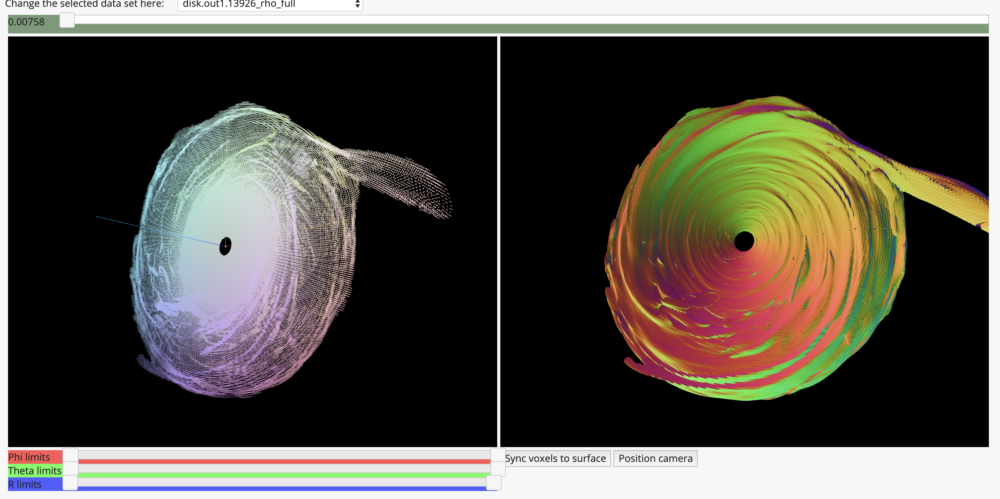

# radiation_viz
Visualizations for astrophysical radiation simulation data.

View the example visualization here:
<a href="https://flatironinstitute.github.io/radiation_viz/">https://flatironinstitute.github.io/radiation_viz/</a>.



This is an experimental project which uses Python 3 for preprocessing of data files and HTML5/Javascript in a
modern browser like Chrome for presentation. Please install it in development mode to make it easy to update.
You will need a local Python 3 installation (such as one installed by Anaconda
http://docs.anaconda.com) to run the preprocessing for the visualization.

To install the Python3 `radiation_viz` pre-processing module locally in development mode:

```bash
    % git clone https://github.com/flatironinstitute/radiation_viz.git
    % cd radiation_viz
    % pip3 install -e .
```

The `radiation_viz.prepare_viz_data` module preprocesses an HDF5 file with the `.athdf` suffix
to produce a directory tree containing web code and data files for viewing the data in the file.

Here is the help output from the script:

```
% python -m radiation_viz.prepare_viz_data -h
usage: prepare_viz_data.py [-h] [--to_directory TO_DIRECTORY] [--truncated]
                           [--skip SKIP] [--quiet] [--force] [--clean]
                           [--dry_run] [--launch] [--view_only]
                           FILE [FILE ...]

positional arguments:
  FILE                  Source file to convert. Must end in '.athdf'.

optional arguments:
  -h, --help            show this help message and exit
  --to_directory TO_DIRECTORY
                        Destination directory where to place the visualization
                        and data.
  --truncated           Don't generate full resolution.
  --skip SKIP           Skip stride for truncated views (0 for none).
  --quiet               Don't print helpful output.
  --force               Don't prompt for verification and overwrite existing
                        files.
  --clean               Delete existing visualization folder if it exists.
  --dry_run             List intended actions but don't make permanent
                        changes.
  --launch              Start server and attempt to open the visualization in
                        a browser.
  --view_only           Only start server and attempt to open the
                        visualization in a browser.
```

For example the following usage creates low resolution visualization data
from the `disk.out1.13926.athdf` HDF5 source file
and then attempts to launch a web server and redirect the system browser to
the visualization `index` page.

```
% python -m radiation_viz.prepare_viz_data disk.out1.13926.athdf --truncated --clean --launch

Arguments parsed.
Loading data from file(s).
   loading metadata for '/Users/awatters/misc/Yan-Fei_Jiang/disk.out1.13926.athdf'
    Found 'Bcc1' at ('B', 0) in /Users/awatters/misc/Yan-Fei_Jiang/disk.out1.13926.athdf
        ... VERBOSE OUTPUT DELETED ...
    Found 'vel3' at ('prim', 4) in /Users/awatters/misc/Yan-Fei_Jiang/disk.out1.13926.athdf
Preparing to install or update visualization directory: '/Users/awatters/misc/Yan-Fei_Jiang/radiation_viz'
   existing directory will be deleted.
    Folder data will be cloned from: '/Users/awatters/repos/radiation_viz/radiation_viz/viz_template'
Checking whether output data files exist.
    Existing file to overwrite '/Users/awatters/misc/Yan-Fei_Jiang/radiation_viz/processed_data/disk.out1.13926_Bcc1_skip_4.json'
        ... VERBOSE OUTPUT DELETED
    Existing file to overwrite '/Users/awatters/misc/Yan-Fei_Jiang/radiation_viz/processed_data/disk.out1.13926_vel3_skip_4.bin'

*** PLEASE CONFIRM: Make changes (Y/N)? Y
deleting exiting folder '/Users/awatters/misc/Yan-Fei_Jiang/radiation_viz'
Setting up directory '/Users/awatters/misc/Yan-Fei_Jiang/radiation_viz'
Writing output data files.
    writing expanded data ('Bcc1', 4) disk.out1.13926_Bcc1_skip_4
from /Users/awatters/misc/Yan-Fei_Jiang/disk.out1.13926.athdf B 0
(4720, 33) (4720, 5) (4720, 33) (4720, 32, 4, 32)
    truncating (4720, 33) by 4
   to (4720, 9) (4720, 5) (4720, 9) (4720, 8, 4, 8)
    wrote json to /Users/awatters/misc/Yan-Fei_Jiang/radiation_viz/processed_data/disk.out1.13926_Bcc1_skip_4.json
    wrote binary to /Users/awatters/misc/Yan-Fei_Jiang/radiation_viz/processed_data/disk.out1.13926_Bcc1_skip_4.bin
    writing expanded data ('Bcc2', 4) disk.out1.13926_Bcc2_skip_4
         ... VERBOSE OUTPUT DELETED ...
(4720, 33) (4720, 5) (4720, 33) (4720, 32, 4, 32)
    truncating (4720, 33) by 4
   to (4720, 9) (4720, 5) (4720, 9) (4720, 8, 4, 8)
    wrote json to /Users/awatters/misc/Yan-Fei_Jiang/radiation_viz/processed_data/disk.out1.13926_vel3_skip_4.json
    wrote binary to /Users/awatters/misc/Yan-Fei_Jiang/radiation_viz/processed_data/disk.out1.13926_vel3_skip_4.bin
Configured 9 files in /Users/awatters/misc/Yan-Fei_Jiang/radiation_viz/config.json.
Attempting to launch web server and redirect system browser.
Starting simple web server.  Use CONTROL-C to terminate: http://localhost:9999/index.html
Attempting to redirect browser to  http://localhost:9999/index.html
127.0.0.1 - - [22/Apr/2020 14:45:13] "GET /config.json HTTP/1.1" 200 -
127.0.0.1 - - [22/Apr/2020 14:45:13] "GET /processed_data/disk.out1.13926_Bcc1_skip_4.json HTTP/1.1" 200 -
127.0.0.1 - - [22/Apr/2020 14:45:13] "GET /processed_data/disk.out1.13926_Bcc1_skip_4.bin HTTP/1.1" 200 -
```

The script asks the user to confirm changes before the changes are made (unless `--force` is specified).
The above command created the visualization folder at the default location `./radiation_viz/...` in the current
directory by default.  The web server required for 
viewing the visualization in a browser is left running and must be terminated by `CONTROL-C` as indicated in the
output.

Due to "cross origin restrictions" on dynamic data loading
the visualization page cannot be viewed using the "file:" protocol and
must be viewed via a web server.

After the view folder has been built the following command line will attempt to open
the visualization without rebuilding the data:

```
% python -m radiation_viz.prepare_viz_data disk.out1.13926.athdf --view_only
```

The following command line will build high resolution data files as well as low resolution data files for the visualization without
attempting to view the visualization automatically:

```
python -m radiation_viz.prepare_viz_data --force
```

The `--force` flag allows the script to replace existing files and suppresses the user confirmation.

It takes some time generate the full resolution data files mainly due to logic which "interpolates
across data block boundaries".  On my laptop just now the above command took about 10 minutes.

Also note that slider operations and view synchronization in the visualization are not very performant for the high
resolution data views due the the size of the data.
